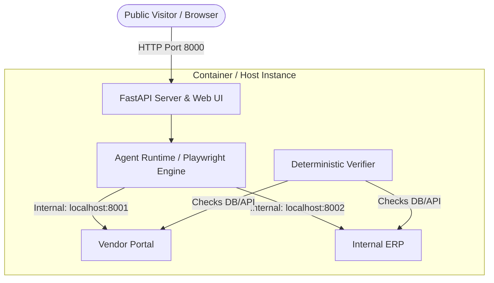

# Deployment Guide: Autonomous AI Task Worker

This guide explains how to deploy the Autonomous AI Task Worker system to cloud hosting environments (such as Render, Railway, Fly.io, or any Linux VPS) and answers the core architecture question regarding the mock target websites.

---

## 1. Should You Deploy the Two Mock Websites As Well?

### **Short Answer: YES, but bundle them internally.**

The entire workflow of this autonomous worker is **cross-application automation**:
1. The agent launches a headless browser (Playwright) to log into the **Vendor Portal** and locate invoice records.
2. The agent navigates to the **Internal ERP** to log in, fill accounting forms, and submit bills.
3. The deterministic verifier inspects both the Vendor Portal and the ERP database to score the run.

If the Vendor Portal and Internal ERP are not running and reachable by the agent:
> Any task triggered by an evaluator, recruiter, or user will fail immediately with `ERR_CONNECTION_REFUSED` on step 1.

---

### **How to Deploy Them (Without Extra Cost or Domains)**

You **do NOT** need to purchase domains or configure 3 separate cloud web services. 

Instead, use an **All-in-One Container Architecture**:
- **Only Port 8000 (Main UI & Server)** is exposed to the public internet for visitors.
- **Port 8001 (Vendor Portal)** and **Port 8002 (Internal ERP)** run as local background processes on `127.0.0.1` inside the same machine/container.
- Since Playwright runs *inside* that same container/host, `http://localhost:8001` and `http://localhost:8002` (as configured in `config/environment.yaml`) work instantly without changing any URL settings or managing cross-origin CORS!



---

## 2. Deployment Options

### Option A: Docker / Docker Compose (Recommended)

A production-ready [Dockerfile](file:///Users/shekharnarayanmishra/Desktop/Autonomus%20AI/Dockerfile) and [docker-compose.yml](file:///Users/shekharnarayanmishra/Desktop/Autonomus%20AI/docker-compose.yml) are included in this repository.

#### Prerequisites
- Docker & Docker Compose installed.

#### Run with Docker Compose
```bash
# 1. Set your LLM keys in .env
cp .env.example .env
# Edit .env with your GEMINI_API_KEY, GROQ_API_KEY, or OPENROUTER_API_KEY

# 2. Build and launch
docker compose up -d --build

# 3. View logs
docker compose logs -f
```
The public UI will be available at `http://your-server-ip:8000`.

---

### Option B: Cloud PaaS (Render / Railway / Fly.io)

Cloud PaaS providers allow zero-devops continuous deployment directly from your GitHub repository.

#### 1. Deploying on Render (Docker Web Service)
1. Go to [Render Dashboard](https://dashboard.render.com/) -> **New** -> **Web Service**.
2. Connect your GitHub repository (`Autonomous-Ai-Worker`).
3. Select **Docker** as the Environment / Runtime.
4. Set the Instance Type (at least **1 GB RAM** is recommended because Playwright Chromium runs headless in the container).
5. In **Environment Variables**, add:
   - `GEMINI_API_KEY` = your Gemini key
   - `GROQ_API_KEY` = your Groq key (optional fallback)
   - `OPENROUTER_API_KEY` = your OpenRouter key (optional fallback)
   - `PORT` = `8000`
6. Click **Create Web Service**.
   - Render will build the Dockerfile, execute `entrypoint.sh`, initialize the mock databases, start ports 8001 & 8002 in the background, and expose port 8000 publicly.

#### 2. Deploying on Railway
1. Click **New Project** -> **Deploy from GitHub repo**.
2. Railway detects the `Dockerfile` automatically.
3. Under **Variables**, add your API keys (`GEMINI_API_KEY`, etc.).
4. Under **Settings** -> **Networking**, generate a public domain pointing to port `8000`.

#### 3. Deploying on Fly.io
```bash
# Launch application from project directory
fly launch --no-deploy

# Set secret keys
fly secrets set GEMINI_API_KEY=your_key GROQ_API_KEY=your_key

# Deploy
fly deploy
```

---

### Option C: Bare Linux VPS (Ubuntu / Debian / EC2 / DigitalOcean)

If deploying directly to a virtual machine without Docker:

```bash
# 1. Update system and install Python 3.11 + Git
sudo apt update && sudo apt install -y python3-pip python3-venv git curl

# 2. Clone repository
git clone https://github.com/your-username/Autonomous-Ai-Worker.git
cd Autonomous-Ai-Worker

# 3. Create virtual environment and install dependencies
python3 -m venv venv
source venv/bin/activate
pip install -r requirements.txt

# 4. Install Playwright browser and system OS libraries
playwright install --with-deps chromium

# 5. Initialize mock databases
python mock_env/seed.py

# 6. Configure environment variables
cp .env.example .env
nano .env

# 7. Start the stack in background using the entrypoint script
nohup ./entrypoint.sh > server.log 2>&1 &
```

To configure automatic restart on server reboot, set up a systemd service:
```ini
# /etc/systemd/system/autonomous-ai.service
[Unit]
Description=Autonomous AI Worker Service
After=network.target

[Service]
Type=simple
User=ubuntu
WorkingDirectory=/home/ubuntu/Autonomous-Ai-Worker
ExecStart=/home/ubuntu/Autonomous-Ai-Worker/entrypoint.sh
Restart=always
EnvironmentFile=/home/ubuntu/Autonomous-Ai-Worker/.env

[Install]
WantedBy=multi-user.target
```
Enable and start the service:
```bash
sudo systemctl daemon-reload
sudo systemctl enable --now autonomous-ai.service
```

---

## 3. Important Production Requirements & Checklist

| Requirement | Why it's needed | How it's handled |
| :--- | :--- | :--- |
| **Playwright System Deps** | Headless Chromium requires OS libraries (`libnss3`, `libasound2`, etc.). | Handled by `playwright install --with-deps chromium` in `Dockerfile`. |
| **Database Seeding** | Invoice INV-101 and vendor data must exist. | Handled automatically by `python mock_env/seed.py` on startup. |
| **Memory Allocation** | Headless browser execution requires minimum 512MB–1GB RAM. | Use instances with at least 1GB RAM (standard free/starter tiers on Render, Railway, or Fly.io). |
| **Ports 8001 & 8002** | Target mock portals for browser navigation. | Bound internally to `127.0.0.1` so they don't consume extra cloud endpoints. |
| **Port 8000** | Interactive dashboard and SSE trace stream. | Bound to `0.0.0.0` as the sole public HTTP endpoint. |

---

## 4. Deploying to Real Target Applications Instead of Mock Sites

If you ever transition this agent from a portfolio evaluation showcase to a real internal operations worker:
1. Update [config/environment.yaml](file:///Users/shekharnarayanmishra/Desktop/Autonomus%20AI/config/environment.yaml):
   ```yaml
   apps:
     - name: "Vendor Portal"
       base_url: "https://vendor.yourcompany.com"
       credentials:
         username: "${PROD_VENDOR_USER}"
         password: "${PROD_VENDOR_PASS}"
     - name: "Internal ERP"
       base_url: "https://erp.yourcompany.com"
       credentials:
         username: "${PROD_ERP_USER}"
         password: "${PROD_ERP_PASS}"
   ```
2. In that case, you do not run `mock_env` servers at all—the agent will navigate directly to your real corporate web portals.
