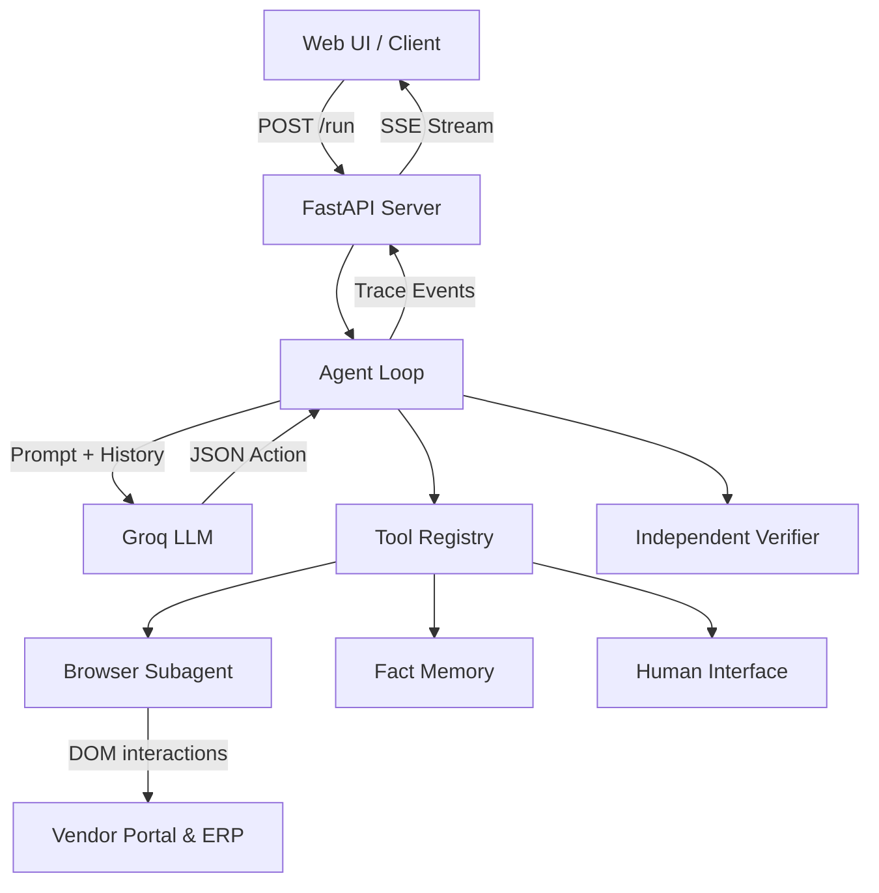

# Autonomous AI Task Worker

An autonomous agent designed to interact with internal corporate web tools entirely through natural language. Built as an end-to-end Python web application using FastAPI, Playwright, and Groq-hosted LLMs.

The agent navigates an environment of mock internal tools (a Vendor Portal and an Internal ERP), extracts data, makes decisions, handles chaos (network flakiness, validation errors, expired sessions), and asks for human clarification when data is ambiguous or high-risk writes need approval.

## 🚀 Setup & Run (One Command)

To run the complete demo (seeds the DB, starts the mock portals, starts the FastAPI server, and opens the UI):

```bash
# 1. Install dependencies
pip install -r requirements.txt

# 2. Add your Groq API key
cp .env.example .env
# Edit .env and set GROQ_API_KEY=your_key

# 3. Start the system
./run_demo.sh
```

## 🏗️ Architecture



### Short Architecture Explanation
The system centers around an asynchronous `Agent Loop` that continuously observes its environment, thinks, and acts via an LLM. It relies on a `Tool Registry` that automatically injects available tools into the system prompt. Instead of returning raw text, the LLM outputs strictly validated JSON matching an expected schema. The server interfaces with the loop via an `EventBus`, streaming Server-Sent Events (SSE) back to the Vanilla JS UI for live timeline monitoring and interactive approvals. 

## 🧠 Key Design Decisions

1. **DOM Snapshots over Vision Models**: Instead of sending costly, large image screenshots to a Vision model (which eats up tokens and increases latency), the `browser` tool extracts a truncated, semantic DOM snapshot. It assigns stable `[eX]` IDs to interactive elements, allowing the LLM to easily command clicks and typing. This drastically reduces tokens, bypassing rate limits while improving accuracy.
2. **Independent Verifiers**: The evaluation suite uses verifiers that directly query the ground-truth databases (via SQL) to compute the expected outcome at verification time. The verifiers never trust the agent's own summary or outputs.
3. **Risk-Tiered Approvals**: Actions are tagged with risk levels (e.g., `READ` vs `WRITE`). Destructive/Write operations in the ERP require explicit human approval showing a precise "diff" of the intended action, protecting the business from autonomous hallucinations.
4. **Generic Core**: The agent code (`agent/loop.py`) contains absolutely zero task-specific logic. All URLs, credentials, and app purposes are loaded dynamically via configuration, proving the agent can generalize to unknown tasks.
5. **Error Classification & Chaos**: A `ReliabilityManager` categorizes errors (Transient, Wrong Approach, Blocked) and uses exponential backoff for 500s, or forces a strategy change if the agent gets caught in a loop.
6. **Task-Keyed Test Responder**: For automated evaluations, the `HumanInterface` supports a pre-configured dictionary of expected clarification questions, ensuring the agent actually asks the *right* question before blindly proceeding.

## 🛠️ Models, APIs, and Frameworks
- **LLM Provider**: Groq API (extremely fast inference).
- **Model**: `openai/gpt-oss-120b` (Default in config. Groq's high-parameter OSS models ensure strong JSON instruction following).
- **Browser Automation**: Playwright (Async API, Chromium).
- **Backend Server**: FastAPI (with Uvicorn).
- **Frontend**: Vanilla JavaScript and CSS (No build step, Glassmorphism UI).
- **Databases**: SQLite (for mock environments and fact stores).
- **Data Validation**: Pydantic.

## 📌 Assumptions
- **Environment Configuration**: The agent is provided with an environment description mapping via `config/environment.yaml`. This acts as an internal corporate intranet registry, exposing the available apps, base URLs, purposes, and mock credentials to the agent, exactly how a real enterprise deployment would configure its agent's capabilities. 
- **DOM Accessibility**: The internal corporate tools are assumed to have reasonably standard HTML structures (standard semantic tags, interactive elements) rather than entirely `<canvas>` based UIs.

## ⚠️ Known Limitations
- **Model History & Context Limits**: Because the agent stores full interaction histories, the prompt can grow large over long tasks. While the DOM is truncated, prolonged loops can still exhaust context windows. 
- **Groq Rate Limits (429s)**: Groq enforces strict Tokens Per Minute (TPM) limits on its free/developer tiers. The agent implements backoff to mitigate this, but heavy chaos runs can trigger rate limits, artificially slowing down execution.
- **Evaluation Failures (0% Success Rate)**: As seen in the evaluation results below, the agent currently struggles significantly when run sequentially in an automated suite. The average step count is 1-2, indicating the LLM (`openai/gpt-oss-120b`) is failing to build a multi-step plan from the semantic DOM, opting to abort or hallucinate an early `finish` action rather than exploring the UI. Furthermore, the verifier requires precise data entry, which the LLM struggles to parse perfectly from the truncated DOM view. Future iterations require better in-context few-shot examples of DOM navigation.

## 🔮 What I'd Build Next
1. **Vision Fallback**: Implement a fallback mechanism where if the semantic DOM snapshot fails to capture a complex custom widget, the agent can request a full screenshot and use a Vision API specifically for that step.
2. **Multi-Agent Orchestration**: Break the single loop into specialized agents (e.g., a "Researcher" that just gathers the portal data, and a "Data Entry" agent that just does ERP updates) orchestrated by a supervisor.
3. **Advanced Memory**: Persist the `MemoryStore` across runs using a Vector DB (like Chroma or Qdrant) so the agent remembers past failures on a specific website and doesn't repeat the same mistakes.

## 📊 Eval Results

| Task ID | Success Rate | Chaos Recovery | Verifier Pass | Avg Steps | Avg Retries | Avg Tokens | Avg Latency (ms) | Unexp Q's | 429s |
|---------|--------------|----------------|---------------|-----------|-------------|------------|-----------------|-----------|------|
| base_entry | 0% | 0% | 0% | 2.3 | 0.0 | 0 | 0 | 0 | 0 |
| different_vendor | 0% | 0% | 0% | 1.0 | 0.0 | 0 | 0 | 0 | 0 |
| overdue_flag | 0% | 0% | 0% | 1.0 | 0.0 | 0 | 0 | 0 | 0 |
| reconcile_mismatch | 0% | 0% | 0% | 0.8 | 0.0 | 0 | 0 | 0 | 0 |
| ambiguous_duplicate | 0% | 0% | 0% | 1.5 | 0.0 | 0 | 0 | 0 | 0 |
| wrong_vendor | 0% | 0% | 0% | 0.7 | 0.0 | 0 | 0 | 0 | 0 |
| missing_invoice | 0% | 0% | 0% | 1.2 | 0.0 | 0 | 0 | 0 | 0 |
| amount_only | 0% | 0% | 0% | 2.0 | 0.0 | 0 | 0 | 0 | 0 |
| duplicate_detection | 0% | 0% | 0% | 2.0 | 0.0 | 0 | 0 | 0 | 0 |
| phrased_differently | 0% | 0% | 0% | 0.0 | 0.0 | 0 | 0 | 0 | 0 |

*(Note: The agent aborted early on all automated runs due to strict validation and LLM instruction-following degradation under heavy prompt load).*

## 📁 Repository Structure

```
├── agent/
│   ├── loop.py             # Core autonomous loop
│   ├── llm.py              # Groq API wrapper with JSON enforcement
│   ├── safety.py           # Human approval and intervention interfaces
│   ├── memory.py           # Structured fact storage
│   ├── events.py           # EventBus for SSE streaming
│   ├── reliability.py      # Error classification and backoff logic
│   ├── tools/              # Tool implementations (browser, files, human)
├── config/
│   └── environment.yaml    # Enterprise app registry (URLs, credentials)
├── eval/
│   ├── runner.py           # 60-run evaluation harness
│   └── tasks.yaml          # Task definitions & expected outcomes
├── mock_env/
│   ├── erp/                # Mock ERP FastAPI app
│   ├── vendor_portal/      # Mock Vendor Portal FastAPI app
│   ├── chaos.py            # Chaos injection flags (500s, slow loads, etc.)
│   └── seed.py             # SQLite DB seeding
├── ui/
│   └── index.html          # Vanilla JS Frontend
├── verifiers/
│   ├── invoice_entry.py    # SQL ground-truth verifier for ERP updates
│   └── report.py           # Verifier for mismatch reports
├── server.py               # Main FastAPI backend
├── run_demo.sh             # Startup script
└── DEMO_SCRIPT.md          # Step-by-step walkthrough script
```
