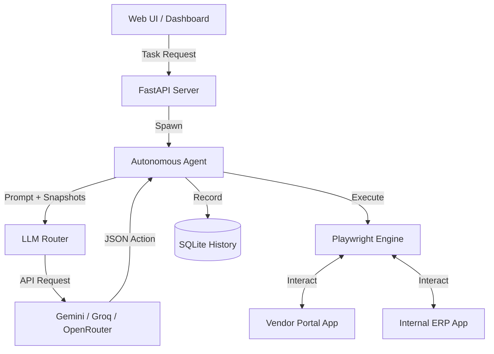

# Autonomous AI Task Worker

A fully autonomous browser automation agent capable of complex, cross-application workflows using Playwright and multimodal LLMs. The agent handles transient infrastructure errors, ambiguous situations, and multi-step tasks across a mock Vendor Portal and an Internal ERP system.

## 🚀 Setup and Run

1. **Clone and Install:**
   ```bash
   git clone <repository_url>
   cd Autonomous-Ai-Worker
   python3 -m venv venv
   source venv/bin/activate
   pip install -r requirements.txt
   playwright install
   ```

2. **Configure Environment:**
   Review `config/environment.yaml`. By default, it contains mock sandbox credentials.
   Ensure your API keys for the chosen LLM providers (e.g. Gemini, Groq, OpenRouter) are set in your environment variables.

3. **Run the Demo:**
   ```bash
   ./run_demo.sh
   ```
   This spins up the local mock applications (Vendor Portal on port 8001, ERP on port 8002) and the central web UI (port 8000). The UI will automatically open in your browser.

4. **Run the E2E Live Eval:**
   ```bash
   python -m eval.live --tasks base --runs 1 --go
   ```

## 🏗️ Architecture



## 🧠 Design Decisions & Reasoning

- **Multi-Provider Fallback:** Instead of relying on a single provider, the `LLMChainManager` seamlessly routes requests across Gemini, Groq, and OpenRouter. This mitigates the stringent limits of free-tier APIs and handles `429 Too Many Requests` intelligently by computing exact cooldown windows (e.g. `Reset-Time`).
- **Resilient Playwright Engine:** Flaky 500s and unexpected modals are trapped by a `ReliabilityManager`. The agent distinguishes between transient infra errors (safe to retry) and wrong-approach errors (requiring LLM re-planning).
- **Tool-Based Form Filling:** Instead of guessing coordinates or hoping for perfect accessibility trees, the Playwright agent provides precise DOM snapshots containing `id`, `placeholder`, and `type` attributes, making it mathematically certain for the LLM to output valid `fill_form` actions.
- **Asynchronous FastAPI Backend:** Enables non-blocking SSE streams for real-time UI updates (trace logs, step latency, token consumption) without stalling the event loop.

## 🛠️ Models, APIs, and Frameworks

- **LLM Providers:** Google Gemini, Groq, OpenRouter (utilizing free-tier APIs).
- **Core Automation:** Playwright (Python async API) for headless browser manipulation.
- **Backend Server:** FastAPI and Uvicorn for handling WebSockets and SSE.
- **Data & Config:** SQLite (for task histories/runs) and PyYAML.
- **Testing:** Pytest, unittest.mock.
- **Disclosure:** AI coding tools were used extensively in the creation and rapid prototyping of this repository.

## ⚠️ Assumptions and Known Limitations

- **Assumptions:** 
  - The system assumes all target web apps are accessible on localhost via ports `8001` and `8002` as configured in `config/environment.yaml`.
  - Credentials in `environment.yaml` are purely mock sandbox values.
- **Known Limitations:**
  - **Free-Tier Quotas:** Sustained runs across multiple tasks will quickly exhaust daily/minute quotas across providers, triggering the hard-coded budget guards.
  - **Model Variance:** Smaller models may hallucinate tool arguments or loop endlessly if they lose context.
  - **Offline Results:** The `results.md` and tests in `scripted_provider.py` are plumbing tests. Real live results (`results_live.json`) require `--go` and are heavily subject to a small N (due to quota caps).

## 🔮 What I'd Build Next

1. **Self-Healing Selectors:** If a UI element ID changes, the agent should dynamically search visually and fall back on visual-text embeddings rather than just DOM labels.
2. **Context Compression:** Long task histories consume massive token budgets. I'd add a "Memory Summarizer" step that squashes steps 1-10 into a brief paragraph.
3. **Advanced Human-in-the-Loop:** Provide a live terminal directly in the UI where the human can assume control of the Playwright cursor during ambiguous moments, record the sequence, and return control to the agent.
4. **Cloud Database:** Move the local SQLite trace store to a hosted Postgres instance to build a global performance dashboard.

